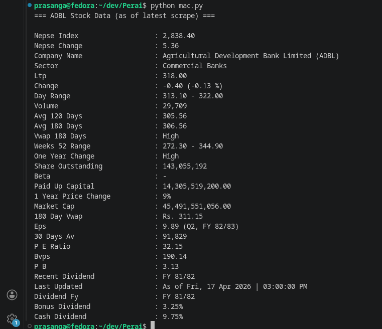

# Nepse Free API - Stock Data Scraper

<div align="center">

[](https://www.python.org/downloads/)
[](LICENSE)
[](https://github.com/prasangapokharel/NEPSE-FREE-API)
[](https://github.com/prasangapokharel/NEPSE-FREE-API)
[](https://github.com/prasangapokharel/NEPSE-FREE-API)

A lightweight, efficient Python web scraper for fetching real-time Nepali stock market data from [nepalipaisa.com](https://nepalipaisa.com). Built with educational purposes in mind.

[View on GitHub](https://github.com/prasangapokharel/NEPSE-FREE-API) • [Report Bug](https://github.com/prasangapokharel/NEPSE-FREE-API/issues) • [Request Feature](https://github.com/prasangapokharel/NEPSE-FREE-API/issues)

</div>

---

## 📋 Table of Contents

- [Features](#features)
- [Quick Start](#quick-start)
- [Installation](#installation)
- [Usage](#usage)
- [API Reference](#api-reference)
- [Demo](#demo)
- [Advanced Usage](#advanced-usage)
- [Error Handling](#error-handling)
- [Project Statistics](#project-statistics)
- [Important Notice](#important-notice)
- [Contributing](#contributing)
- [License](#license)
- [Support](#support)

---

## ✨ Features

- 📊 **Real-time Stock Data** - Fetch current stock prices and NEPSE market indices instantly
- 💼 **Comprehensive Information** - Retrieve LTP, volume, price ranges, 120/180-day averages
- 📈 **Fundamental Data** - Access company sector, dividend info, P/E ratio, P/B ratio, and more
- 🛡️ **Robust Error Handling** - Built-in error handling for network and parsing issues
- 🎯 **Simple API** - Intuitive class-based interface perfect for beginners and professionals
- 🔒 **Proper Headers** - Respects website with realistic User-Agent headers
- ⚡ **Fast & Efficient** - 15-second timeout with optimized parsing
- 📱 **CSV Symbol List** - Pre-loaded list of 335+ Nepali stock symbols

---

## 🚀 Quick Start

```python
from main import Stock

# Initialize the scraper
api = Stock()

# Fetch stock data
data = api.get_data("ADBL")

# Display results
for key, value in data.items():
    print(f"{key}: {value}")
```

---

## 📦 Installation

### Prerequisites

- **Python**: 3.7 or higher
- **pip**: Python package manager
- **Git**: For cloning the repository (optional)

### Setup Instructions

#### Method 1: Clone from GitHub

```bash
# Clone the repository
git clone https://github.com/prasangapokharel/NEPSE-FREE-API.git
cd NEPSE-FREE-API

# Install dependencies
pip install -r requirements.txt

# Run the scraper
python main.py
```

#### Method 2: Manual Setup

```bash
# Create a directory
mkdir nepse-scraper
cd nepse-scraper

# Download requirements.txt and main.py manually, then:
pip install -r requirements.txt
python main.py
```

#### Method 3: Install via pip (Future)

```bash
pip install nepse-free-api
```

---

## 📖 Usage

### Basic Usage

```python
from main import Stock

# Create an instance
api = Stock()

# Fetch ADBL stock data
result = api.get_data("ADBL")

# Print all data
for key, value in result.items():
    print(f"{key.replace('_', ' ').title()}: {value}")
```

### Available Stock Symbols

**Common Symbols:**
- `ADBL` - Agricultural Development Bank Limited
- `NABIL` - Nabil Bank Limited
- `NTC` - Nepal Telecommunications Authority
- `EBL` - Everest Bank Limited
- `SCB` - Standard Chartered Bank Nepal
- `HBL` - Himalayan Bank Limited
- `NIB` - Nepal Insurance Bank

**Complete List:**
See `symbol.csv` for all 335+ available symbols.

### Fetch Multiple Stocks

```python
from main import Stock

api = Stock()
symbols = ["ADBL", "NABIL", "EBL", "NTC"]

for symbol in symbols:
    data = api.get_data(symbol)
    if "error" not in data:
        print(f"Company: {data.get('company_name', 'N/A')}")
        print(f"LTP: {data.get('ltp', 'N/A')}")
        print("---")
```

---

## 🔌 API Reference

### Stock Class

#### `Stock.get_data(symbol="ADBL")`

Fetches stock data for a given symbol.

**Parameters:**
- `symbol` (str): Stock symbol to fetch. Default is `"ADBL"`

**Returns:**
- `dict`: Dictionary containing stock information or error message

**Raises:**
- `RequestException`: Network connectivity issues
- `ParseException`: HTML parsing errors

---

## 📊 Return Value Structure

The `get_data()` method returns a dictionary with the following keys:

| Key | Type | Description |
|-----|------|-------------|
| `nepse_index` | str | Current NEPSE Index value |
| `nepse_change` | str | NEPSE Index change |
| `company_name` | str | Full company name |
| `sector` | str | Industry sector classification |
| `ltp` | str | Last Traded Price |
| `change` | str | Price change with percentage |
| `day_range` | str | Day's trading range (low-high) |
| `volume` | str | Trading volume |
| `avg_120_days` | str | 120-day average price |
| `avg_180_days` | str | 180-day average price |
| `vwap_180_days` | str | 180-day Volume Weighted Average |
| `weeks_52_range` | str | 52-week price range |
| `one_year_change` | str | 1-year price change percentage |
| `last_updated` | str | Data update timestamp |
| `dividend_fy` | str | Recent dividend fiscal year |
| `bonus_dividend` | str | Bonus dividend percentage |
| `cash_dividend` | str | Cash dividend percentage |

---

## 🎬 Demo

### Live Terminal Output

The script provides beautifully formatted output in your terminal:



### Sample Output

```
=== ADBL Stock Data (as of latest scrape) ===

Nepse Index                   : 2,838.40
Nepse Change                  : 5.36
Company Name                  : Agricultural Development Bank Limited (ADBL)
Sector                        : Commercial Banks
Ltp                           : 318.00
Change                        : -0.40 (-0.13 %)
Day Range                     : 313.10 - 322.00
Volume                        : 29,709
Avg 120 Days                  : 305.56
Avg 180 Days                  : 306.56
Vwap 180 Days                 : High
Weeks 52 Range                : 272.30 - 344.90
One Year Change               : High
Share Outstanding             : 143,055,192
Beta                          : -
Paid Up Capital               : 14,305,519,200.00
1 Year Price Change           : 9%
Market Cap                    : 45,491,551,056.00
180 Day Vwap                  : Rs. 311.15
Eps                           : 9.89 (Q2, FY 82/83)
30 Days Av                    : 91,829
P E Ratio                     : 32.15
Bvps                          : 190.14
P B                           : 3.13
Recent Dividend               : FY 81/82
Last Updated                  : As of Fri, 17 Apr 2026 | 03:00:00 PM
Dividend Fy                   : FY 81/82
Bonus Dividend                : 3.25%
Cash Dividend                 : 9.75%
```

---

## 🔧 Advanced Usage

### Error Handling

```python
from main import Stock

api = Stock()

try:
    data = api.get_data("ADBL")
    
    if "error" in data:
        print(f"Error: {data['error']}")
    else:
        company = data.get('company_name', 'Unknown')
        price = data.get('ltp', 'N/A')
        print(f"{company}: Rs. {price}")
        
except Exception as e:
    print(f"Exception occurred: {str(e)}")
```

### Batch Processing

```python
from main import Stock
import time

api = Stock()
symbols = ["ADBL", "NABIL", "NTC", "EBL", "SCB"]

for symbol in symbols:
    data = api.get_data(symbol)
    
    if "error" not in data:
        print(f"{symbol}: {data.get('ltp')} ({data.get('change')})")
    
    # Be respectful to the server
    time.sleep(1)
```

### Data Analysis

```python
from main import Stock
import csv

api = Stock()

# Fetch and store data
with open('stock_data.csv', 'w', newline='') as f:
    writer = csv.writer(f)
    writer.writerow(['Symbol', 'Company', 'LTP', 'Change', 'Sector'])
    
    symbols = ["ADBL", "NABIL", "NTC"]
    
    for symbol in symbols:
        data = api.get_data(symbol)
        if "error" not in data:
            writer.writerow([
                symbol,
                data.get('company_name'),
                data.get('ltp'),
                data.get('change'),
                data.get('sector')
            ])
```

---

## ⚠️ Error Handling

The scraper handles two types of errors gracefully:

### 1. Request Errors
- Network connectivity issues
- Server timeouts (15-second limit)
- Invalid HTTP responses

### 2. Parsing Errors
- HTML structure changes
- Missing elements or fields
- Unexpected data formats

**Example:**
```python
result = api.get_data("INVALID")

if "error" in result:
    print(f"Error occurred: {result['error']}")
    # Handle error appropriately
```

---

## 📊 Project Statistics

<div align="center">

| Metric | Value |
|--------|-------|
| **Language** | Python 3.7+ |
| **License** | MIT |
| **Total Symbols** | 335+ |
| **Last Updated** | Apr 2026 |
| **Status** | Active |
| **Version** | 1.0.0 |

</div>

---

## ⚠️ Important Notice

### Educational Use Only

This project is developed **exclusively for educational purposes**. It is not intended for production use or real-time financial decision-making due to:

- **No Sandbox Testing**: Untested in sandboxed environments with official APIs
- **Web Scraping Risks**: Susceptible to website structure changes without notice
- **No Warranty**: No guarantees about data accuracy, completeness, or timeliness
- **Terms of Service**: Users must ensure compliance with nepalipaisa.com's ToS
- **Data Reliability**: Scraped data may be incomplete, delayed, or inaccurate

### Legal Disclaimer

This tool is for **educational and informational purposes only**. The author is **not responsible** for any financial decisions made based on this tool's output. 

**⚠️ Always verify data from official sources before making investment decisions. Use at your own risk.**

---

## 📋 Requirements

- `requests>=2.25.0` - HTTP library for web requests
- `beautifulsoup4>=4.9.0` - HTML/XML parsing
- `certifi>=2021.0.0` - SSL certificate validation

### Install All Dependencies

```bash
pip install -r requirements.txt
```

---

## 🤝 Contributing

Contributions are welcome and appreciated! Here's how you can help:

### Report Bugs

Found a bug? Please open an [issue](https://github.com/prasangapokharel/NEPSE-FREE-API/issues) with:
- Clear description of the bug
- Steps to reproduce
- Expected vs actual behavior
- Python version and OS

### Request Features

Have an idea? Submit a [feature request](https://github.com/prasangapokharel/NEPSE-FREE-API/issues) describing:
- The feature you want
- Why it would be useful
- Possible implementation approach

### Submit Pull Requests

1. Fork the repository
2. Create a feature branch (`git checkout -b feature/AmazingFeature`)
3. Commit your changes (`git commit -m 'Add some AmazingFeature'`)
4. Push to the branch (`git push origin feature/AmazingFeature`)
5. Open a Pull Request

---

## 📄 License

This project is licensed under the **MIT License** - see the [LICENSE](LICENSE) file for details.

```
MIT License

Copyright (c) 2026 Prasanga Pokharel

Permission is hereby granted, free of charge, to any person obtaining a copy
of this software and associated documentation files (the "Software"), to deal
in the Software without restriction, including without limitation the rights
to use, copy, modify, merge, publish, distribute, sublicense, and/or sell
copies of the Software, and to permit persons to whom the Software is
furnished to do so, subject to the following conditions:

The above copyright notice and this permission notice shall be included in all
copies or substantial portions of the Software.
```

---

## 🆘 Support

Need help? Here are several ways to get support:

### Documentation
- 📖 Read the [full README](README.md)
- 💻 Check out [example scripts](examples/) (if available)
- 📚 Review [API Reference](#-api-reference)

### Community
- 🐛 Report bugs on [GitHub Issues](https://github.com/prasangapokharel/NEPSE-FREE-API/issues)
- 💡 Request features on [GitHub Discussions](https://github.com/prasangapokharel/NEPSE-FREE-API/issues)
- 📧 Contact via email (see GitHub profile)

---

## 👨‍💻 Author

**Prasanga Pokharel**

- GitHub: [@prasangapokharel](https://github.com/prasangapokharel)
- Repository: [NEPSE-FREE-API](https://github.com/prasangapokharel/NEPSE-FREE-API)

---

## 🎓 Credits

- Data source: [nepalipaisa.com](https://nepalipaisa.com)
- Built with: [BeautifulSoup](https://www.crummy.com/software/BeautifulSoup/) and [Requests](https://requests.readthedocs.io/)

---

## 📈 Roadmap

- [ ] Add caching mechanism for frequently accessed data
- [ ] Create REST API wrapper
- [ ] Build web dashboard
- [ ] Add real-time data streaming
- [ ] Implement data export to Excel/JSON
- [ ] Create command-line interface (CLI)
- [ ] Add logging and monitoring
- [ ] Database integration for historical data

---

## ⭐ Show Your Support

If this project helped you, please consider:
- ⭐ Starring the repository
- 🍴 Forking the project
- 📢 Sharing with others
- 💬 Providing feedback

---

<div align="center">

**Made with ❤️ by Prasanga Pokharel**

[⬆ back to top](#nepse-free-api---stock-data-scraper)

</div>
